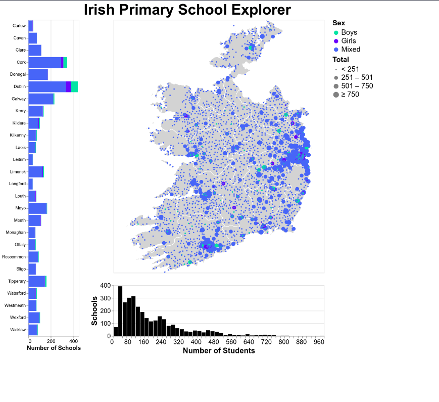
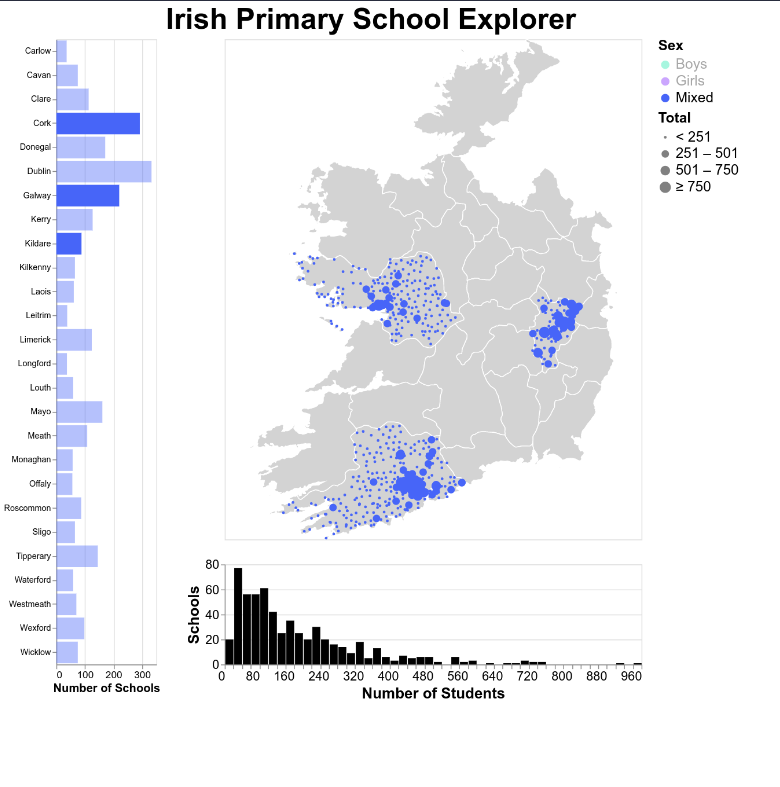
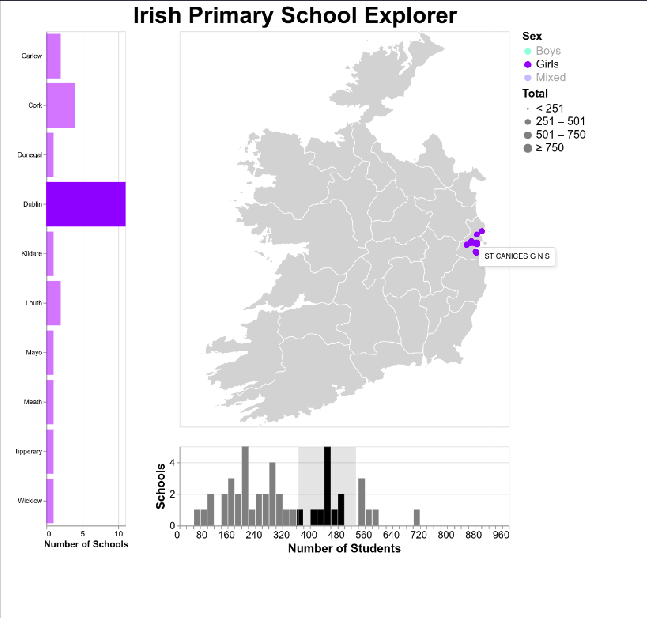

# Irish Primary Schools Dashboard

A dashboard created in vega-lite. A few pointers here are:

* The horizontal bar chart encompasses the number of schools in each county.
* The bottom bar chart bins the schools according to the number of students in each school.
* The map shows the location of each school in Ireland.
* The colours indicate whether it is a Boy's, Girl's or Mixed school. 
* The size of the pointers indicate the number of students in each school.

The dashboard is interactive - counties can be chosen from the chart on the left, while sex can be selected from the label. 

A brush interaction can be used to select a range of schools according to number of students in the bottom bar-chart.

